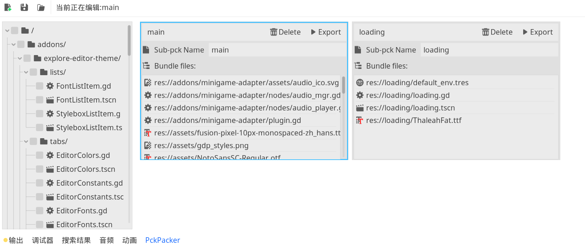

    

# Pck export plugin.
When we need to export pck files in packages, there isn't a suitable tool to record and automate the quick export process. That's where this plugin comes in. Its purpose is to accelerate the initial loading of the web or to be used for project patches.
> Usage Instructions 📣
- Install the plugin in your project.
- Create a new configuration file (click the + button on the interface).
- Select the file you want to export as a pck in the file tree on the left, then click the Save button.
- Click the Export button on the configuration file card to export it to the  [CurrentProject]/dist/[PackItemName].pck.

Have fun! 👋

## License

[MIT](LICENSE).